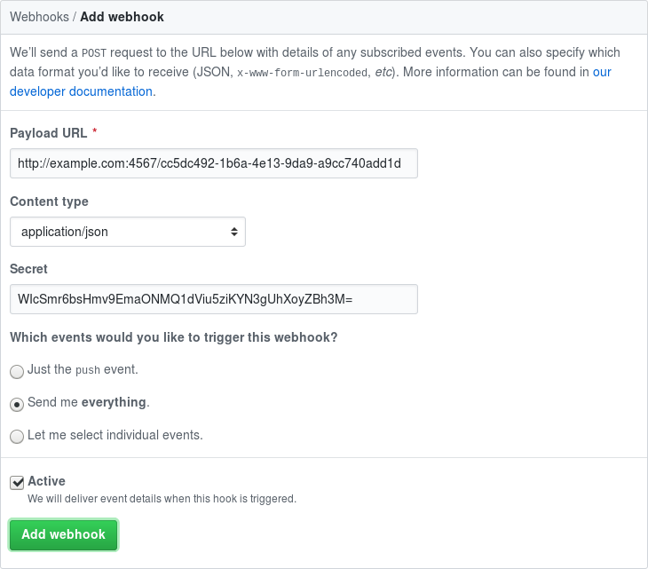

# Codebot

[](https://rubygems.org/gems/codebot)
[](https://rubygems.org/gems/codebot)
[](https://travis-ci.org/janikrabe/codebot)
[](https://inch-ci.org/github/janikrabe/codebot)

Codebot is an IRC bot that receives GitHub webhooks and forwards them to
IRC channels. It is designed to send messages in a format similar to that
of the official GitHub IRC Service. Codebot is able to stay connected after
sending messages. This eliminates the delays and visual clutter caused by
reconnecting each time a new message has to be delivered.

In addition, Codebot is able to handle many events the official service does not
support. Messages for these events are designed to be as consistent as possible
with official messages. If these additional notifications are not desired, they
can be disabled through the webhook settings.

## Features

* **Secure by default**: Codebot automatically generates strong random secrets
  for each webhook to ensure the integrity of all received data.
* **Highly configurable**: Do you use IRC over TLS or want to authenticate
  using SASL? Do you need to send notifications to a password-protected server
  or bind the IRC socket to a certain address? No problem!
* **Easy to set up**: Setting up Codebot takes three minutes — no need to edit
  configuration files or memorize complicated commands.
* **Supports many events**: Codebot supports all events supported by GitHub's
  official IRC integration, and a few more! Individual events can be enabled or
  disabled through the webhook settings.
* **Unlimited networks, channels and integrations**: a single instance can
  receive notifications for any number of webhooks and forward them to the
  appropriate channels on as many IRC networks as you want.
* **On-the-fly reloading**: A running Codebot instance can automatically pick
  up any new changes with no restart required.
  (*Changes to channel lists currently still require a restart.*)
* **Rack and Sinatra**: Thanks to Rack, Codebot can work with almost any web
  server, including the default `WEBrick` server for smaller instances.

## Installation

You can install Codebot from RubyGems by issuing the following command:

```
$ gem install codebot
```

## Usage

First, add the IRC networks you want to send notifications to. Remove `--secure`
to connect on port `6667` without TLS.

```
$ codebot network create freenode --host chat.freenode.net --nick git --secure
```

Next, create an integration to route a webhook endpoint to a set of IRC channels:

```
$ codebot integration create project-name -c freenode/#channel1 -c freenode/#channel2
```

You can then add a GitHub webhook to any repositories and organizations you'd
like to receive notifications from.



**Payload URL** should be in the format `protocol://your-server:4567/endpoint`,
where `protocol` is either `http` or `https`, `your-server` is the IP address
or hostname of the server running Codebot, and `endpoint` is replaced with the
endpoint of the integration created in the previous step.

**Content type** can be set to either value, but `application/json` is
recommended.

**Secret** should be set to the secret of the integration created in the
previous step. This value is used for verifying the integrity of payloads.

You may want to choose *Let me select individual events* if you do not want to
receive notifications for all events Codebot supports.

After adding the webhook to your GitHub repository or organization, you can
manage your Codebot instance using the following commands:

```
$ codebot core start       # Starts a new instance in the background (as a daemon)
$ codebot core stop        # Stops an active Codebot instance
$ codebot core interactive # Starts Codebot interactively without forking
```

For more information, see `codebot help`, `codebot network --help`,
`codebot integration --help`, and `codebot core --help`.

The configuration is stored in `~/.codebot.yml`, but it is not recommended to
edit this file manually.

## Development

After checking out the repository, run `bundle install` to install dependencies.
You can also run `bin/console` for an interactive prompt.

To install this gem onto your local machine, run `bundle exec rake install`.
To release a new version, update the version number in `version.rb`, and then
run `bundle exec rake release`, which will create a git tag for the version,
push git commits and tags, and push the `.gem` file to
[RubyGems](https://rubygems.org/gems/codebot).

## Contributing

Bug reports and pull requests are welcome on GitHub at
[janikrabe/codebot](https://github.com/janikrabe/codebot).
